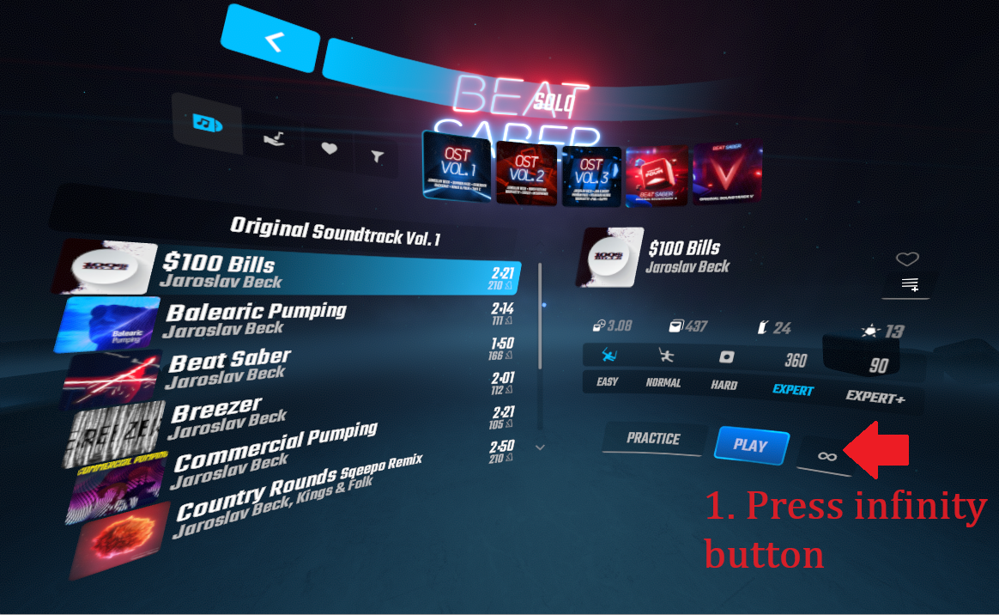

# Infinite Beat Saber

A Beat Saber for PC mod that generates never-ending and ever changing variations of existing Beat Saber levels. Play your favorite songs for as long as you want &mdash; they never end!

This mod is both inspired by the [The Infinite Jukebox](https://musicmachinery.com/2012/11/12/the-infinite-jukebox/) and leverages some of its source code. See the [Credits](#credits) section for details.

## How to Play

1. Install the Infinite Beat Saber mod using [ModAssistant](https://github.com/Assistant/ModAssistant/) or a mechanism of your choosing. If you haven't installed any Beat Saber mods before, you might want to check out the [PC Modding page on the Beat Saber Modding Group Wiki](https://bsmg.wiki/pc-modding.html). (If you prefer manual installation, see the [Manual Installation](./docs/manual-installation.md) doc.)
2. Launch Beat Saber.
3. Press the "Solo" button.
4. Press the "Custom Levels" button &mdash; (1) in the screenshot.
5. Select one of the [currently supported levels](#currently-supported-levels). Only the Standard, One Saber, and No Arrows modes are currently supported.
6. Press the button with the infinity symbol on it &mdash; (2) in the screenshot.
7. Play the song for as long as you like &mdash; it never ends!

Here's a screenshot highlighting the relevant UI:

If you don't see the infinity button, it could mean one of these things:
1. The selected song isn't currently supported.
2. The selected mode isn't currently supported &mdash; only the Standard, One Saber, and No Arrows modes are currently supported.
3. The Infinite Beat Saber mod isn't installed.

## Currently Supported Levels

Currently only these custom levels are supported:
- [Gangnam Style by PSY. Mapped by GreatYazer](https://bsaber.com/songs/141/)
- Beat Saber by Jaroslav Beck

Built-in levels aren't currently supported.

## How to Add Additional Levels

See the [How to Add Additional Levels](./docs/how-to-add-additional-levels.md) doc.

## How It Works

For songs in Spotify's catalog, [Spotify's audio analysis web API](https://developer.spotify.com/documentation/web-api/reference/get-audio-analysis) provides information about their structure and musical content including rhythm, pitch, and timbre. The Infinite Jukebox algorithm (see [InfiniteJukeboxAlgorithm/](./InfiniteBeatSaber/InfiniteJukeboxAlgorithm/)) uses this information to figure out which sections of the song are so similar that it can jump the song from one section to the other without the listener noticing a seam in the music. The result is a never-ending list of song sections &mdash; play this section, then this section, then this section, etc.

Based on this never-ending list of song sections, Infinite Beat Saber slices up the audio and beatmap which results in a never-ending Beat Saber level.

If you're interested in understanding the code, [InfiniteBeatSaberMode.cs](./InfiniteBeatSaber/InfiniteBeatSaberMode.cs) would be a good place to start. It brings together all of the pieces so it contains the big picture. From there, you can jump into any of the pieces that interest you.

## Credits

This mod is inspired by [The Infinite Jukebox](https://musicmachinery.com/2012/11/12/the-infinite-jukebox/) and leverages its algorithm.

The original implementation of [The Infinite Jukebox](https://musicmachinery.com/2012/11/12/the-infinite-jukebox/) is by Paul Lamere.

The code for the Infinite Jukebox algorithm in this repo is derived from [The Eternal Jukebox by UnderMybrella](https://github.com/UnderMybrella/EternalJukebox/), a rework of the original project.

I published my extraction of the Infinite Jukebox algorithm to [its own repo](https://github.com/rigdern/InfiniteJukeboxAlgorithm) to make it easier for anyone that wants to make use of the algorithm in their own projects.

## Support My Work

If you'd like to support my work, consider [buying me a coffee on ko-fi](https://ko-fi.com/adamcomella).

## License

[MIT](./LICENSE)
