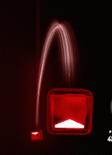
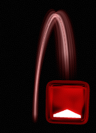
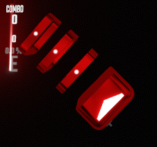

# Beatmap Item Representation

First, let's define a couple of terms. A *beatmap* is a description of a Beat Saber level. It states the timestamp of the note blocks, bombs, obstacles, and other parts of the level that approach the player at the pace of the music. Each of these is called a *beatmap item*.

Understanding how Beat Saber represents each *beatmap item* is useful for working on the [`BeatmapRemixer`](https://github.com/rigdern/InfiniteBeatSaber/blob/765fc659e08f1531353402685996f4baa9cf9778/InfiniteBeatSaber/BeatmapRemixer.cs). The [`BeatmapRemixer`](https://github.com/rigdern/InfiniteBeatSaber/blob/765fc659e08f1531353402685996f4baa9cf9778/InfiniteBeatSaber/BeatmapRemixer.cs) is responsible for slicing up and rearranging &mdash; remixing &mdash; the beatmap based on the sequence of slices returned by [`InfiniteRemix`](https://github.com/rigdern/InfiniteBeatSaber/blob/765fc659e08f1531353402685996f4baa9cf9778/InfiniteBeatSaber/InfiniteRemix.cs). ([See here](https://infinitebeatsaber.substack.com/i/137830642/how-it-works) for an overview of `BeatmapRemixer` and `InfiniteRemix`)

For the purposes of [`BeatmapRemixer`](https://github.com/rigdern/InfiniteBeatSaber/blob/765fc659e08f1531353402685996f4baa9cf9778/InfiniteBeatSaber/BeatmapRemixer.cs), we want to understand which C# classes are used to represent each beatmap item and the meaning of each of the classes' properties.

These notes are incomplete because I only investigated enough to figure out what I needed to know for implementing [`BeatmapRemixer`](https://github.com/rigdern/InfiniteBeatSaber/blob/765fc659e08f1531353402685996f4baa9cf9778/InfiniteBeatSaber/BeatmapRemixer.cs).

## Not yet covered
The below beatmap item types aren't currently covered. I wrote this document while trying to figure out Beat Saber's representation of [arcs and chains](https://www.youtube.com/watch?v=S5EnYBttaaA) so this document only covers that.

- Note
- Bomb
- Obstacle
- Light
- Color boost (I think this enables you to switch between 2 different color schemes)
- BPM change

## Arc
(For an introduction to arcs, see [Arc And Chain Notes Tutorial by Beat Saber Official (YouTube)](https://www.youtube.com/watch?v=S5EnYBttaaA))

Two connected notes are called an *arc*. It looks like this:



The arc's tail can be omitted. The beatmap for Curtains (All Night Long) on Easy in Standard mode makes use of this. Here's what it looks like:



Another possibility is 3+ notes connected by arcs: the first note is connected to the second note, the second note is connected to the third note, the third note is connected to the fourth note, etc.

### Representation
An arc consists of these pieces:
- **A head note.** Represented by the class `NoteData` with its `gameplayType` set to `Normal`.
- **A tail note.** Represented by the class `NoteData` with its `gameplayType` set to `Normal`.
- **A connecting arc pointing from the head note to the tail note.** Represented by the class `SliderData` with its `sliderType` set to `Normal`.

Below is example code illustrating how to construct each piece of the arc. There's also [a real implementation of `SpawnArc` in Infinite Beat Saber](https://github.com/rigdern/InfiniteBeatSaber/blob/765fc659e08f1531353402685996f4baa9cf9778/Eval/EvalProgram.cs#L1245-L1303).

```csharp
// `timestamp` is the timestamp of the song at which the arc should start.
void SpawnArc(int timestamp)
{
    var headTime = timestamp;
    // Tail note will occur half a second after the head note.
    var tailTime = headTime + 0.5f;

    // Head note.
    AddBeatmapDataItem(
        NoteData.CreateBasicNoteData(
            time: headTime,
            lineIndex: 2, // Note's x position
            noteLineLayer: NoteLineLayer.Top, // Note's y position
            colorType: ColorType.ColorA,
            cutDirection: NoteCutDirection.Up));

    // Connecting arc.
    AddBeatmapDataItem(
        new SliderData(
            sliderType: SliderData.Type.Normal,
            colorType: ColorType.ColorA, // Arc's color

            // Head note properties. The arc uses this information to
            // decide exactly where the arc visual should start.
            hasHeadNote: true,
            headTime: headTime,
            headLineIndex: 2, // Head note's x position
            headLineLayer: NoteLineLayer.Top, // Head note's y position
            headBeforeJumpLineLayer: NoteLineLayer.Base,
            headControlPointLengthMultiplier: 1f, // Affects arc's height. Related
                                                  // to bezier curve control points?
            headCutDirection: NoteCutDirection.Up,
            headCutDirectionAngleOffset: 0f,

            // Tail note properties. The arc uses this information to
            // decide exactly where the arc visual should end.
            hasTailNote: true,
            tailTime: tailTime,
            tailLineIndex: 1, // Tail note's x position
            tailLineLayer: NoteLineLayer.Base, // Tail note's y position
            tailBeforeJumpLineLayer: NoteLineLayer.Base,
            tailControlPointLengthMultiplier: 1f, // Affects arc's height. Related
                                                  // to bezier curve control points?
            tailCutDirection: NoteCutDirection.Down,
            tailCutDirectionAngleOffset: 0f,

            midAnchorMode: SliderMidAnchorMode.Straight,
            sliceCount: 0, // Always 0 for arcs?
            squishAmount: 1f));

    // Tail note.
    AddBeatmapDataItem(
        NoteData.CreateBasicNoteData(
            time: tailTime,
            lineIndex: 1, // Note's x position
            noteLineLayer: NoteLineLayer.Base, // Note's y position
            colorType: ColorType.ColorA,
            cutDirection: NoteCutDirection.Down));
}
```

## Chain
(For an introduction to chains, see [Arc And Chain Notes Tutorial by Beat Saber Official (YouTube)](https://www.youtube.com/watch?v=S5EnYBttaaA))

A note that is split up into multiple pieces is called a *chain*. Each piece in the chain is called a *link*. Here's what a chain looks like:



A *chain* has a duration, the amount of time across which it is spread. In the screenshot, the chain's duration is nearly 0 so every *link* appears at nearly the same timestamp. A chain can also have a duration of a second or two in which case the chain's links would be spread out further across time.

### Representation
- **A head note.** Represented by the class `NoteData` with its `gameplayType` set to `BurstSliderHead`.
- **A description of the links that points at the head note.** Represented by the class `SliderData` with its `sliderType` set to `Burst`.

Below is example code illustrating how to construct each piece of the chain. There's also [a real implementation of `SpawnChain` in Infinite Beat Saber](https://github.com/rigdern/InfiniteBeatSaber/blob/765fc659e08f1531353402685996f4baa9cf9778/Eval/EvalProgram.cs#L1307-L1376).

```csharp
// `timestamp` is the timestamp of the song at which the chain should start.
void SpawnChain(int timestamp)
{
    var headTime = timestamp;
    // Choose `tailTime` so that the chain's duration is
    // just a fraction of a second.
    var tailTime = headTime + 0.01249f;

    // Head note.
    AddBeatmapDataItem(
        CreateBurstSliderHeadNoteData(
            time: headTime,
            lineIndex: 1, // Note's x position
            noteLineLayer: NoteLineLayer.Base, // Note's y position
            beforeJumpNoteLineLayer: NoteLineLayer.Base,
            colorType: ColorType.ColorA,
            cutDirection: NoteCutDirection.UpLeft,
            cutSfxVolumeMultiplier: 1));

    // Description of the links.
    AddBeatmapDataItem(
        new SliderData(
            sliderType: SliderData.Type.Burst,
            colorType: ColorType.ColorA,

            // Head note properties.
            hasHeadNote: true,
            headTime: headTime,
            headLineIndex: 1, // Head note's x position
            headLineLayer: NoteLineLayer.Base, // Head note's y position
            headBeforeJumpLineLayer: NoteLineLayer.Base,
            headControlPointLengthMultiplier: 0f, // Always 0 for chains?
            headCutDirection: NoteCutDirection.UpLeft,
            headCutDirectionAngleOffset: 0f,

            // Tail note properties. These don't matter for chains.
            // `hasTailNote` is set to `false`.
            hasTailNote: false,
            tailTime: tailTime,
            tailLineIndex: 0,
            tailLineLayer: NoteLineLayer.Upper,
            tailBeforeJumpLineLayer: NoteLineLayer.Upper,
            tailControlPointLengthMultiplier: 0f,
            tailCutDirection: NoteCutDirection.Any,
            tailCutDirectionAngleOffset: 0f,

            midAnchorMode: SliderMidAnchorMode.Straight,
            sliceCount: 4, // The number of links in the chain (including the head note?).
            squishAmount: 1f));
}

// Returns an object representing the head note of a chain.
// It's represented by a `NoteData` with its `gameplayType`
// set to `BurstSliderHead`.
NoteData CreateBurstSliderHeadNoteData(
    float time,
    int lineIndex,
    NoteLineLayer noteLineLayer,
    NoteLineLayer beforeJumpNoteLineLayer,
    ColorType colorType,
    NoteCutDirection cutDirection,
    float cutSfxVolumeMultiplier)
{
    // Create a `NoteData`.
    var sliderHead = NoteData.CreateBurstSliderNoteData(
        time: time,
        lineIndex: lineIndex, // Note's x position
        noteLineLayer: noteLineLayer, // Note's y position
        beforeJumpNoteLineLayer: beforeJumpNoteLineLayer,
        colorType: colorType,
        cutDirection: cutDirection,
        cutSfxVolumeMultiplier: cutSfxVolumeMultiplier);

    // Change its `gameplayType` to `BurstSliderHead`.
    sliderHead.ChangeToBurstSliderHead();

    return sliderHead;
}
```

## Gluing arcs & chains back together
Recall that each arc and chain consists of multiple objects that get added to the beatmap. An arc consists of a head note, a tail note, and a connecting arc. A chain consists of a head note and a description of the links.

If Beat Saber is looking at an object representing a connecting arc, how does it know which note is its head note?

Why might an answer to this question be useful? If we're writing code to remix a beatmap and we decide we'd like to delete an arc, we'll need to delete every piece of that arc: the head note, the tail note, and the connecting arc.

Beat Saber only has a few requirements for a note to be considered to be the head of an arc or chain:
- The arc/chain and the note have approximately the same timestamp.
- The arc/chain and the note have the same color.
- The note's x position is the same as that of the head of the arc/chain.
- The note's y position is the same as that of the head of the arc/chain.

Recall that Beat Saber uses `SliderData` to represent a piece of an arc and a piece of a chain:
- Arc. The `SliderData` represents the connecting arc that connects the head note to the tail note.
- Chain. The `SliderData` represents a description of the chain's links. It points at the head note.

So getting into specific data types, the question "is this head note associated with this arc/chain?" becomes "is this head `NoteData` associated with this `SliderData`"?

Here's how we might answer that question in code:
```csharp
bool IsNoteHeadOfSlider(NoteData noteData, SliderData sliderData)
{
    return
        Mathf.Approximately(noteData.time, sliderData.time) &&
        noteData.colorType == sliderData.colorType &&
        noteData.lineIndex == sliderData.headLineIndex && // x position
        noteData.noteLineLayer == sliderData.headLineLayer; // y position
}
```

## Experimenting
If you want to play around with spawning beatmap items such as arcs and chains, you can do so using Infinite Beat Saber's REPL. Spawning notes with the REPL looks like this:


For a detailed introduction to the REPL used by Infinite Beat Saber, see this blog post: [A C# REPL From Scratch in ~100 lines: Try out ideas without relaunching your program](https://infinitebeatsaber.substack.com/p/a-c-repl-from-scratch-in-100-lines).

Here are some relevant links to Infinite Beat Saber's REPL files:
- [REPL entry point (`EvalProgram.EvalMain`)](https://github.com/rigdern/InfiniteBeatSaber/blob/765fc659e08f1531353402685996f4baa9cf9778/Eval/EvalProgram.cs#L47)
- [`SpawnArc` REPL method](https://github.com/rigdern/InfiniteBeatSaber/blob/765fc659e08f1531353402685996f4baa9cf9778/Eval/EvalProgram.cs#L1245-L1303)
- [`SpawnChain` REPL method](https://github.com/rigdern/InfiniteBeatSaber/blob/765fc659e08f1531353402685996f4baa9cf9778/Eval/EvalProgram.cs#L1307-L1376)
